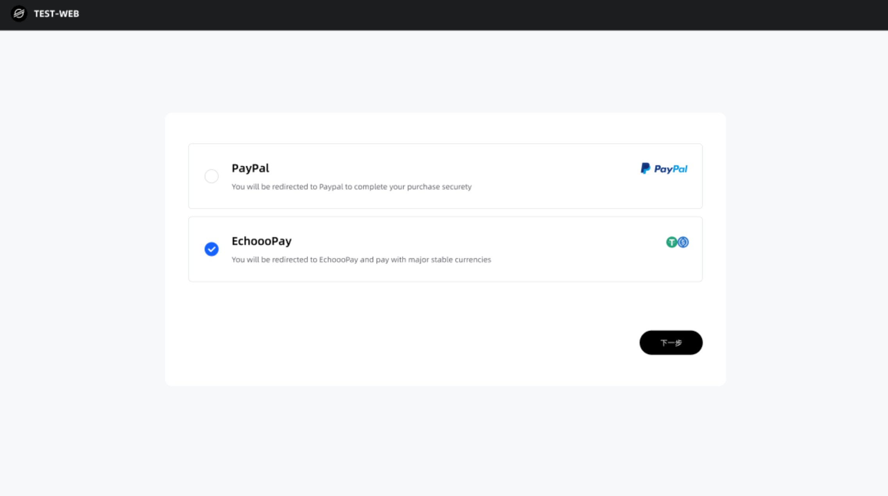
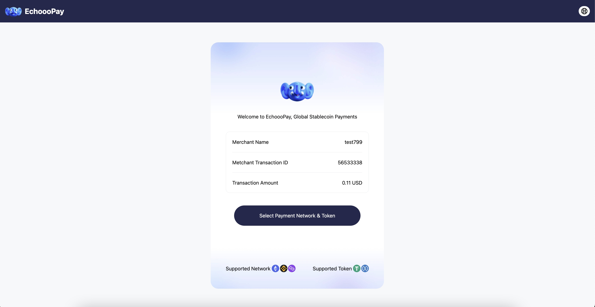
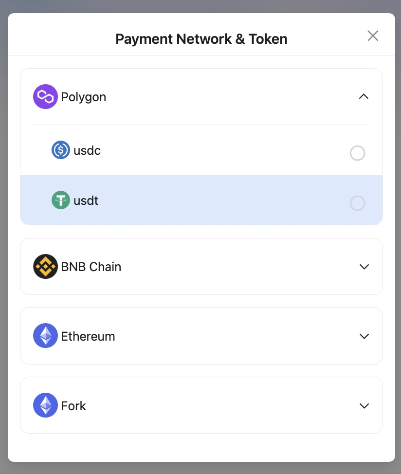

# Initial Transaction

In your application, when users reach the 「Payment Method」 page, they can choose to use "Echooo Pay." Upon clicking, there are two options available for merchants to select and use.&#x20;

Please note that the payment window for each individual order is valid for 30 minutes, and it's important not to make a payment if the time has exceeded the limit.

<figure><figcaption></figcaption></figure>

### Method 1: Call Echooo Pay cashier page 

**You can create EchoooPay order and generate an encrypt link as follow screenshot, EchoooPay will show "Supported Network", Current available network:Ethereum, Polygon, BSC**

<figure><figcaption></figcaption></figure>

**Select Payment network & Token**​

<figure><figcaption></figcaption></figure>

**Scan with your mobile or copy link to proceed the payment**

<figure><figcaption></figcaption></figure>

**Method 2: Use API to create address (Not available now)**
