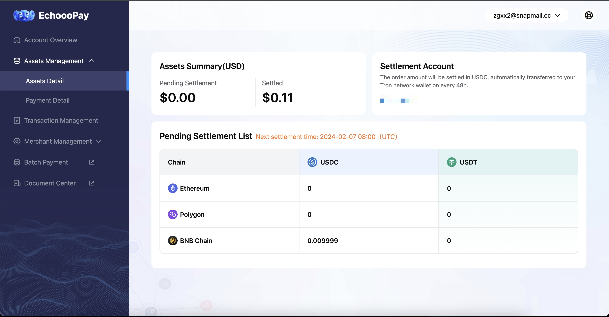
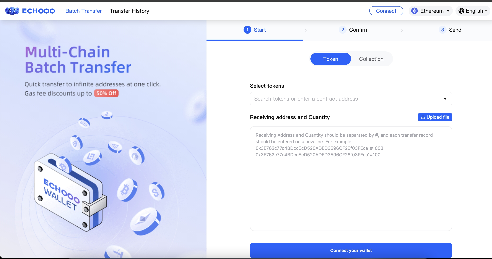
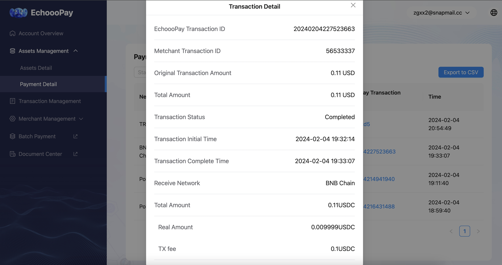
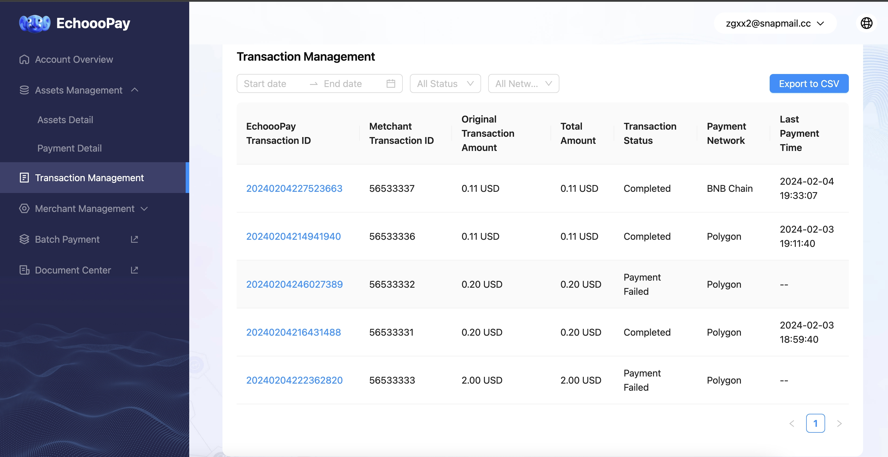

# Portal Management

## Account Overview 

You can view the assets overview, transaction summary, and other related information.

<figure><figcaption></figcaption></figure>

## Assets Detail 

You can periodically check the token balance in your account. Every 48 hours, the settlement will be automatically processed in the form of USDT tokens to the designated receiving account on the Tron network that you have set up. (Please note that the settlement of USDT and USDC on all networks will be converted to USDT on the Tron network at a 1:1 exchange rate for the settlement.)

<figure><figcaption></figcaption></figure>


Echooo Pay provides you with the convenient ability to perform "**Batch Payment**" which can reduce up to 50% of your mining fees. By simply importing a transaction CSV file, you can easily complete the transfer process.


<figure><figcaption></figcaption></figure>

## Payment Detail

#### You can have a clear view of the transaction history and settlement status for all merchants under your account.

【Transaction Income】 You can see the detailed income information of all orders where customers have successfully made payments.

【Transaction Settlement】 You can view the detailed information of settlements that have been successfully transferred to your receiving account.

By clicking "Echooo Pay Transaction ID/Hash", you can review payment detail information

<figure><figcaption></figcaption></figure>

## Transaction Management

**You can view all transaction orders initiated by users here. The transaction order statuses are as follows:**

【Pending Payment】: Orders that have not been paid in full within the 30-minute payment window. This includes orders with a payment amount of 0 and orders where the payment amount has not reached the required amount.

【Payment Successful】: Orders that have been paid in full within the 30-minute payment window. This includes orders with a payment amount equal to the required amount, as well as orders where the payment amount exceeds the required amount.

【Payment Failed】: Orders that have exceeded the 30-minute payment window without being paid in full. This includes orders with a payment amount of 0 and orders where the payment amount has not reached the required amount.

(For orders that are not paid in full or have been overpaid and require a refund, please contact business@echooo.xyz)

<figure><figcaption></figcaption></figure>

