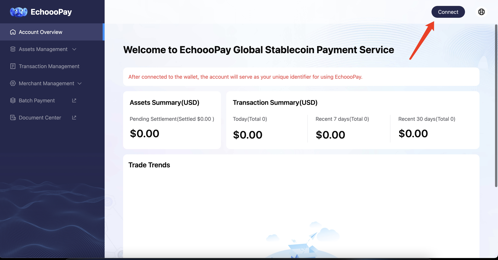
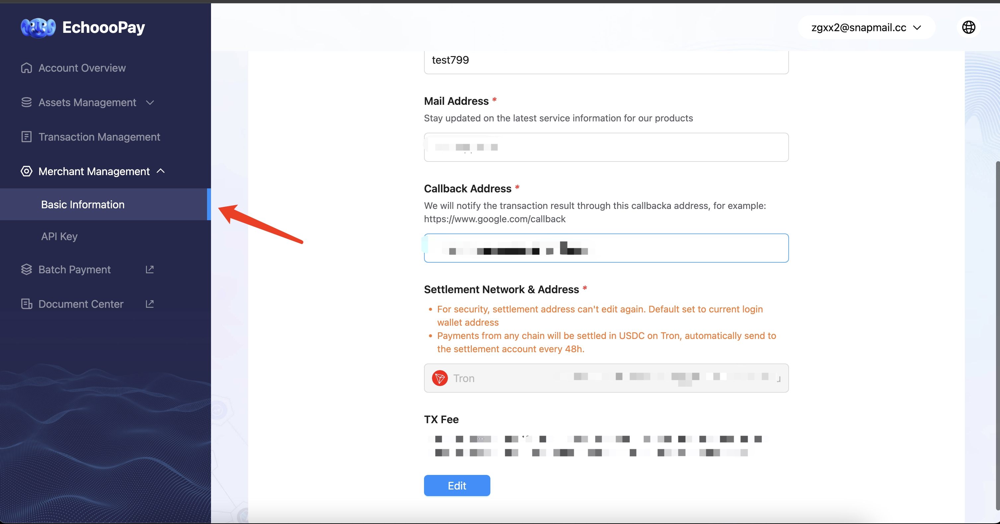
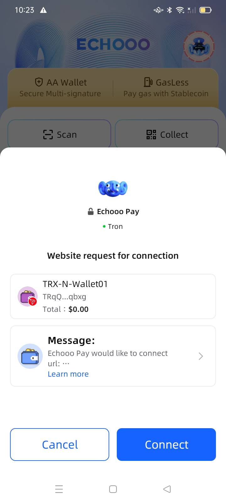

# Merchant Integration


**Merchant Portal Address**:

You can manage your orders, withdrawals, account reconciliation, and configuration changes at the provided address. Please bookmark it for easy access.


## Step 1: Use Echooo Wallet App to Scan and Register Account 

First, please ensure that you have downloaded and registered an account with the Echooo Wallet App (Search **"Echooo"** to download from App Store or Google Play Store). Once you have registered, open the app and use the "**Scan**" feature to scan the login QR code to complete the registration and login process.

<figure><figcaption></figcaption></figure>

## Step2：Input Merchant Basic Information 

Please click on the navigation bar **「Merchant Management」** - **「Basic Information」** Fill in the required fields, including your "Company Name," "Mail Address," and "Callback Address"&#x20;

Additionally, set your receiving network and withdrawal address. Currently, only Tron network withdrawals are supported. The withdrawal address will be confirmed and specified through the "Scan" feature in the Echooo Wallet App, ensuring it corresponds to the desired network for receiving funds.&#x20;

Once you have reviewed and confirmed the information, click the "Submit" button to save and apply the changes.

<figure><figcaption></figcaption></figure>

**Echooo Wallet App Scan to Authorize**

**(Please check the network and refresh again if no confirmation popup window)**

<figure><figcaption></figcaption></figure>

## Step 3: Copy Integration API Key & Start Technical Integration

Please click "Merchant Management"- "API Key" and view your own special encrypt key, and proceed for technical integration.

<figure><figcaption></figcaption></figure>
