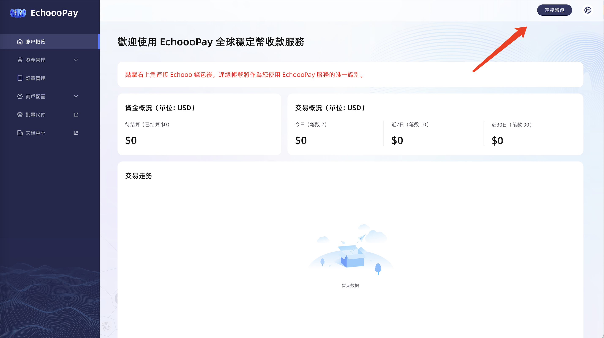

# 商户入网


#### 商户后台地址：待补充

您以后管理订单、提现、对账、修改配置均在该地址，请收藏


## 第一步：使用 Echooo Wallet App 扫描并注册入网账号

#### 首先您需要确保您已下载并注册了 Echooo Wallet App 的账号（可在 AppStore 或 Google 应用商店搜索“Echooo”下载安装）。注册后打开 App 使用 「扫一扫」功能扫描登录二维码，即完成注册登录。

<figure><figcaption></figcaption></figure>

## 第二步：补充商户基本信息

#### 请点击导航栏「商户配置」-「基本信息」，请如实填写您的“企业名称”、“邮箱”、“交易回调地址”，并设置您的收款网络和提现地址，目前仅支持 Tron 网络的提现（提现地址将通过 Echooo Wallet App 的扫一扫功能来确认并指定您要求的对应网络的收款钱包），确认后点击【提交】按钮保存并使用。

<figure><figcaption></figcaption></figure>

#### Echooo Wallet App 扫一扫确认链接钱包的授权页面如下（若未弹出确认浮窗，请刷新网络后重试）

## 第三步：获取对接 API Key ，开始技术对接

#### 请点击导航栏「商户配置」-「 API Key」，设置并查看您专属的密钥，并根据[技术对接](ji-shu-dui-jie.md)进行后续操作。

<figure><figcaption></figcaption></figure>

